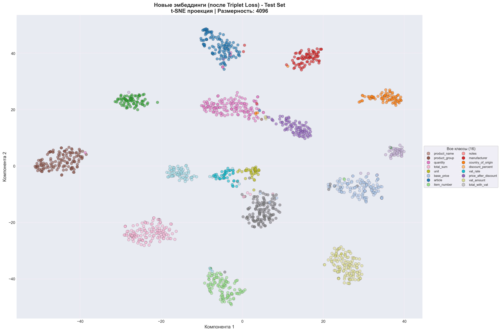
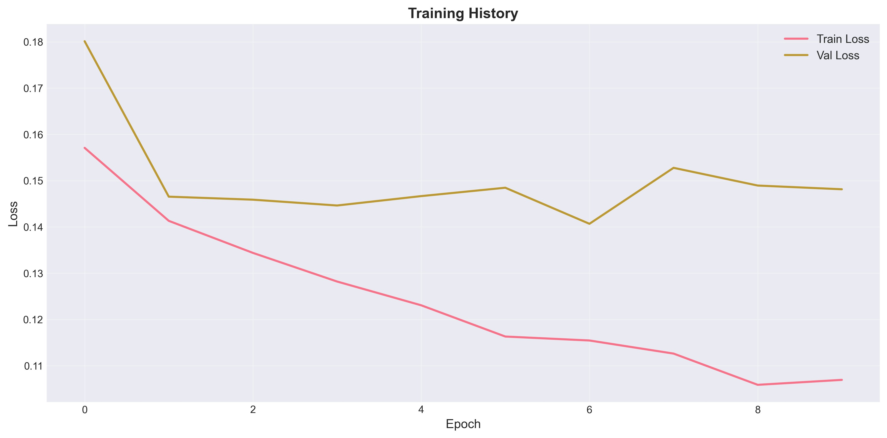
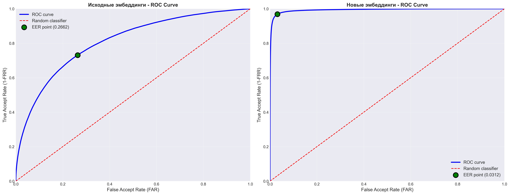
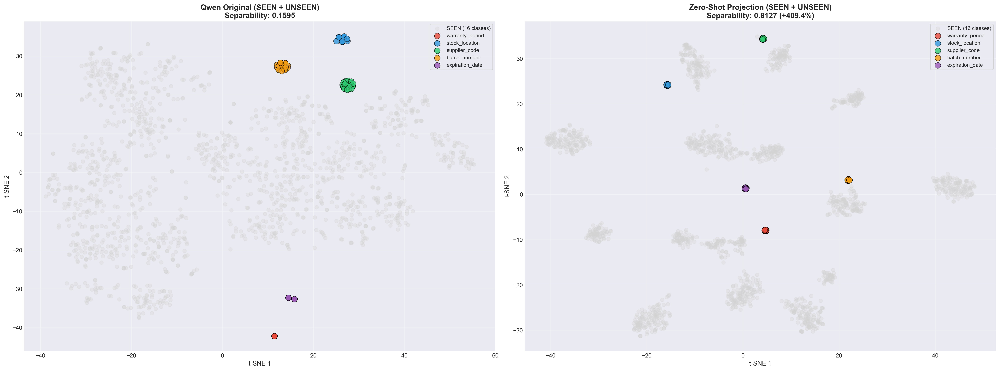
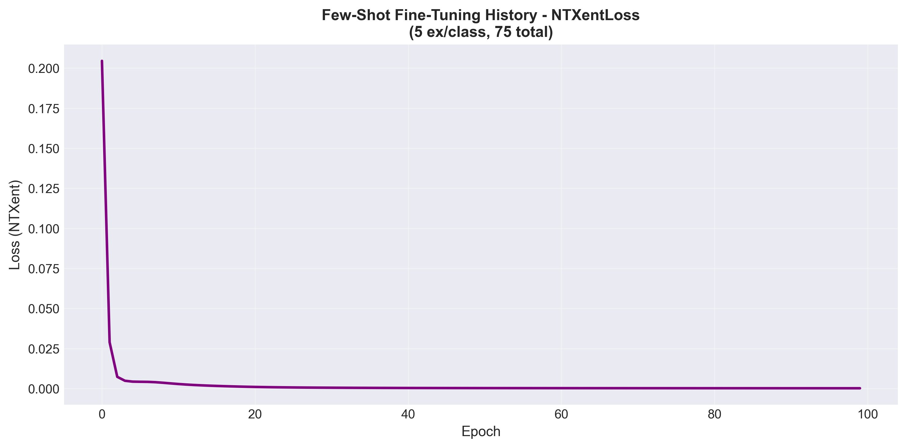
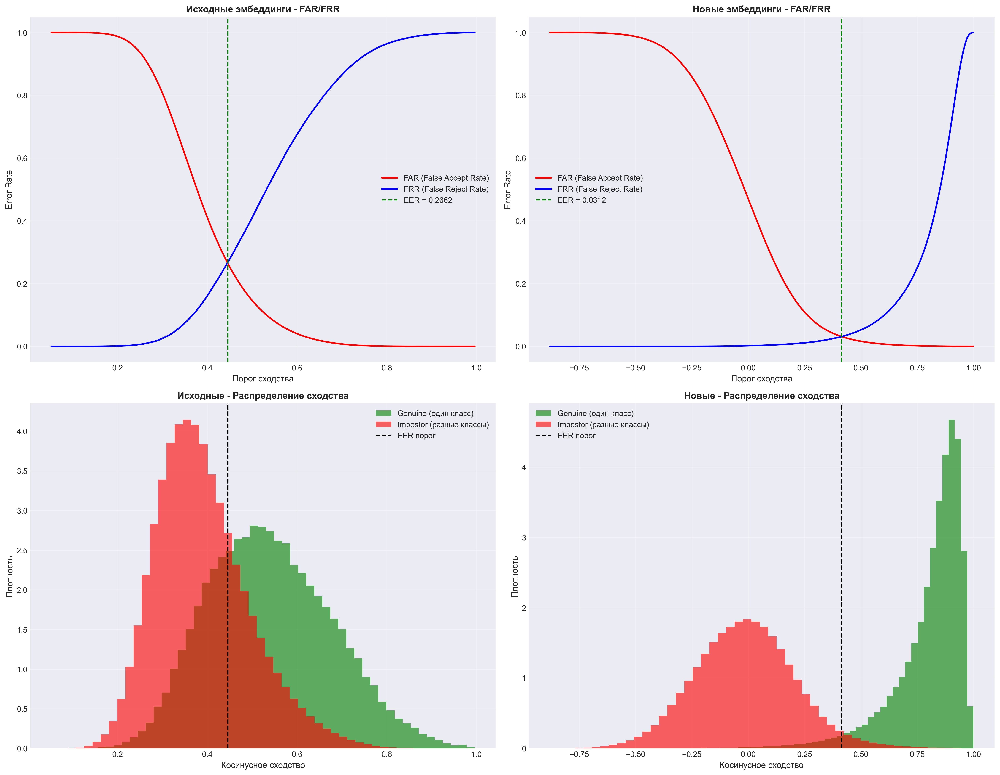

# 🔄 Система унификации таблиц

Интеллектуальная система для автоматической унификации таблиц с различными схемами к единому формату на основе семантического анализа столбцов с использованием эмбеддингов.

## 🎯 Основная идея

Каждый столбец таблицы представляется через:
1. **Описание** — сгенерированное LLM на основе названия, содержимого и типа данных
2. **Вектор (эмбеддинг)** — числовое представление описания
3. **Сопоставление** — поиск соответствий между столбцами через косинусное сходство

## ✨ Основные возможности

### 🚀 Версия 2.0 (Улучшенная)

- ✅ **Кэширование эмбеддингов** — ускорение повторной обработки
- ✅ **Батч-обработка** — эффективная генерация эмбеддингов группами
- ✅ **Учет типов данных** — улучшенное сопоставление через типизацию
- ✅ **Подробные метрики** — детальная аналитика качества унификации
- ✅ **Визуализация** — графики сходства, матрицы, распределения
- ✅ **Гибкая конфигурация** — настройка через JSON файлы
- ✅ **Венгерский алгоритм** — оптимальное сопоставление столбцов

## 📦 Installation

### Quick Install with uv ⚡ (Recommended)

```bash
# Install uv (if not already installed)
# Windows (PowerShell):
powershell -c "irm https://astral.sh/uv/install.ps1 | iex"

# Linux/macOS:
curl -LsSf https://astral.sh/uv/install.sh | sh

# Install project with dataset generation tools
uv pip install -e ".[generation]"
```

### Traditional pip Installation

```bash
# Install from source
git clone https://github.com/yourusername/TableUnifier.git
cd TableUnifier
pip install -e ".[generation]"

# Or install dependencies manually
pip install pandas numpy scikit-learn scipy matplotlib seaborn ollama faker torch torchvision pytorch-metric-learning faiss-cpu
```

### Requirements

- Python 3.9+
- Ollama server with embedding model (e.g., `embeddinggemma`, `qwen3-embedding:8b`)
- 4GB+ RAM recommended

## 🚦 Quick Start

### 0. Setup Ollama (Required!)

```bash
# 1. Start Ollama server (in separate terminal)
ollama serve

# 2. Pull embedding model
ollama pull embeddinggemma

# 3. Verify installation
ollama list
```

**Important:** Use `http://127.0.0.1:11434` in your config, not `http://0.0.0.0:11434`

### 1. Configure the System

Create `project_config.json`:

```json
{
  "ollama": {
    "host": "http://127.0.0.1:11434",
    "embedding_model": "embeddinggemma"
  },
  "embedding": {
    "batch_size": 100,
    "similarity_threshold": 0.5
  }
}
```

### 2. Basic Usage

```python
from table_unifier.core import TableUnifier
from table_unifier.config import AppConfig
import pandas as pd

# Load configuration
config = AppConfig.from_file('project_config.json')

# Create unifier
unifier = TableUnifier(config)

# Reference table (target schema)
reference_df = pd.DataFrame({
    'ID': [1, 2, 3],
    'Name': ['John', 'Mary', 'Peter'],
    'Age': [25, 30, 35]
})

# Target table with different column names
target_df = pd.DataFrame({
    'Number': [1, 2, 3],
    'FullName': ['Anna', 'Sergey', 'Elena'],
    'Years': [28, 32, 45]
})

# Unify the table
unifier.set_reference_schema(reference_df)
unified_df, metrics = unifier.unify_table(target_df)

print(unified_df)
print(f"Matched: {metrics['matched_columns']}/{metrics['total_reference_columns']} columns")
```

### 3. With Visualization

```python
from table_unifier.visualizer import plot_similarity_matrix, print_summary

# Get columns
reference_cols = unifier.reference_columns
target_cols = unifier.process_dataframe(target_df)

# Visualize
plot_similarity_matrix(reference_cols, target_cols)
print_summary(metrics)
```

### 4. Batch Processing Multiple Tables

```python
# Set reference schema once
unifier.set_reference_schema(reference_df)

# Unify multiple tables
tables = [table1_df, table2_df, table3_df]
unified_tables = []

for table in tables:
    unified, metrics = unifier.unify_table(table)
    unified_tables.append(unified)

# Combine results
combined_df = pd.concat(unified_tables, ignore_index=True)
```

### 5. Train Custom Embeddings (Advanced)

Fine-tune embedding models for your specific domain:

```bash
# Navigate to triplet loss pipeline
cd pipelines/triplet_loss

# Train on your dataset
python train_triplet_loss.py
```

See `pipelines/triplet_loss/README.md` for details.

## 📁 Project Structure

```
TableUnifier/
├── src/table_unifier/
│   ├── core.py               # Core unification logic (TableUnifier, EmbSerialV2)
│   ├── models.py             # Ollama LLM and Embedding classes
│   ├── config.py             # Configuration management
│   ├── dataset_utils.py      # Dataset utilities
│   ├── visualizer.py         # Visualization tools
│   └── ds_gen_v3.py          # Dataset generator V3 (Faker-based)
├── pipelines/
│   └── triplet_loss/         # Triplet loss training pipeline
│       ├── triplet_loss_experiment.ipynb
│       └── experiment_config.json
├── datasets/                 # Generated datasets (git-ignored)
├── pyproject.toml            # Project metadata and dependencies
├── project_config.json       # Runtime configuration (git-ignored)
└── README.md                 # This file
```

## ⚙️ Configuration

### JSON Configuration (Recommended)

All project settings are stored in **`project_config.json`**:

```json
{
  "ollama": {
    "host": "http://127.0.0.1:11434",
    "embedding_model": "embeddinggemma",
    "timeout": 120
  },
  "embedding": {
    "batch_size": 100,
    "similarity_threshold": 0.5,
    "include_data_types": true,
    "sample_size": 3
  },
  "classifier": {
    "min_similarity": 0.6,
    "update_alpha": 0.3,
    "auto_update": false
  },
  "dataset_generation": {
    "num_tables": 1000,
    "min_rows_per_table": 7,
    "max_rows_per_table": 7,
    "column_name_variation_level": 0.7,
    "include_typos": true,
    "include_abbreviations": true,
    "include_translations": true,
    "num_workers": 8
  }
}
```

**Usage:**

```python
from table_unifier.config import AppConfig
from table_unifier.core import TableUnifier

# Load from file
config = AppConfig.from_file('project_config.json')

# Use in unifier
unifier = TableUnifier(config)
```

### Programmatic Configuration

```python
from table_unifier.config import AppConfig

config = AppConfig()

# Ollama settings
config.ollama.host = "http://127.0.0.1:11434"
config.ollama.embedding_model = "embeddinggemma"

# Embedding settings
config.embedding.batch_size = 100
config.embedding.similarity_threshold = 0.5
config.embedding.sample_size = 3

# Classifier settings
config.classifier.min_similarity = 0.6
config.classifier.update_alpha = 0.3

# Save/load
config.to_file("my_config.json")
loaded = AppConfig.from_file("my_config.json")
```

## 📊 Metrics and Analytics

After unification, the following metrics are available:

```python
metrics = {
    'total_reference_columns': 10,      # Total reference columns
    'total_target_columns': 12,         # Total columns in target table
    'matched_columns': 8,               # Successfully matched
    'average_similarity': 0.85,         # Average similarity score
    'min_similarity': 0.62,             # Minimum similarity
    'max_similarity': 0.98,             # Maximum similarity
    'threshold_used': 0.6,              # Threshold used for matching
    'detailed_mapping': [...],          # Detailed mapping information
    'missing_columns': [...],           # Unmatched columns
    'unified_columns': [...]            # List of unified columns
}
```

## 📈 Visualizations

### 1. Similarity Matrix
```python
from table_unifier.visualizer import plot_similarity_matrix
plot_similarity_matrix(reference_cols, target_cols)
```

### 2. Quality Metrics
```python
from table_unifier.visualizer import plot_matching_quality
plot_matching_quality(metrics)
```

### 3. Embedding Space
```python
from table_unifier.visualizer import plot_embedding_space
plot_embedding_space(all_columns, method='tsne')
```

### 4. Mapping Report
```python
from table_unifier.visualizer import generate_mapping_report
report_df = generate_mapping_report(metrics)
print(report_df)
```

## 🎓 Examples

Check out the Jupyter notebooks:

- `dataset_quality_analysis.ipynb` - Dataset quality analysis
- `pipelines/triplet_loss/triplet_loss_experiment.ipynb` - Triplet loss training

Run Python examples:

```bash
python -m table_unifier.examples.basic_usage
python -m table_unifier.examples.batch_processing
python -m table_unifier.examples.visualization
```

## 📊 Dataset Generation

### Synthetic Dataset Generator (Faker-based)

Generate realistic test datasets with ground truth for benchmarking:

```bash
# Install dependencies
pip install faker

# Generate dataset
python -m table_unifier.ds_gen_v3
```

**Features:**
- ✅ **Ground Truth Metadata** — Known correct column mappings
- ✅ **High Diversity** — Realistic data via Faker library
- 🚀 **Fast Generation** — 3-5x faster than LLM-based approach
- 📊 **Easy Testing** — Measurable system accuracy
- 🎯 **Controlled Variation** — Typos, abbreviations, translations

**Output:**
- Excel tables with Ground Truth metadata
- Dataset with embeddings and correct answers
- Validation metadata
- Automatic accuracy evaluation scripts

```bash
# Generate dataset
python -m table_unifier.ds_gen_v3

# Validate your system
python examples/validate_dataset_v3.py
```

**Configuration:**

Adjust generation parameters in `project_config.json`:

```json
{
  "dataset_generation": {
    "num_tables": 1000,
    "min_rows_per_table": 7,
    "max_rows_per_table": 7,
    "column_name_variation_level": 0.7,
    "include_typos": true,
    "include_abbreviations": true,
    "include_translations": true,
    "num_workers": 8,
    "locales": ["ru_RU", "en_US"]
  }
}
```

## 🔧 Advanced Features

### Cache Management

```python
# Cache statistics
stats = unifier.get_cache_stats()
print(stats)

# Clear cache
unifier.clear_cache()
```

### Custom Column Objects

```python
from table_unifier.core import EmbSerialV2
import numpy as np

# Create manually
column = EmbSerialV2(
    name="Price",
    content=[100, 200, 300],
    embedding=np.random.rand(768),
    description="Product price in USD",
    data_type="float64"
)
```

### Triplet Loss Fine-Tuning

Train custom embedding models for your specific domain:

```python
# See pipelines/triplet_loss/triplet_loss_experiment.ipynb
# Trains embeddings using triplet loss on your column pairs
```

**Training Results:**

The triplet loss training pipeline significantly improves embedding quality for column matching:

<div align="center">

### Original vs Trained Embeddings

 

*Left: Original embeddings. Right: After triplet loss training - better cluster separation*

### Training Progress



*Training and validation loss over epochs*

### Performance Analysis

 

*Left: Direct comparison. Right: ROC curves showing improved classification*

### Zero-Shot and Few-Shot Performance

 

*Zero-shot performance on unseen columns and few-shot adaptation*

### Biometric-Style Analysis



*False Accept Rate (FAR) and False Reject Rate (FRR) analysis for threshold optimization*

</div>

**Key Improvements:**
- ✅ Better cluster separation between different column types
- ✅ Improved matching accuracy for domain-specific columns
- ✅ Strong zero-shot performance on unseen column types
- ✅ Fast few-shot adaptation with minimal examples

## 🚀 Version History

| Feature | v1.0 | v2.0 | v3.0 |
|---------|------|------|------|
| Caching | ❌ | ✅ | ✅ |
| Batch Processing | ❌ | ✅ | ✅ |
| Data Types | ❌ | ✅ | ✅ |
| Visualization | ❌ | ✅ | ✅ |
| Metrics | Basic | Extended | Extended |
| Configuration | Hardcoded | JSON | JSON |
| Optimization | ❌ | Hungarian | Hungarian |
| Reports | ❌ | ✅ | ✅ |
| Triplet Loss | ❌ | ❌ | ✅ |
| Ground Truth | ❌ | ❌ | ✅ |

## 🧪 Testing

Run validation on generated datasets:

```bash
# Validate system accuracy
python examples/validate_dataset_v3.py

# Run quality analysis
jupyter notebook dataset_quality_analysis.ipynb
```

## 🗺️ Roadmap

- [x] Semantic column matching with embeddings
- [x] Batch processing and caching
- [x] Visualization tools
- [x] Triplet loss training pipeline
- [x] Ground truth dataset generation
- [ ] Support for more embedding models (OpenAI, HuggingFace)
- [ ] Web API interface
- [ ] Schema evolution tracking
- [ ] Multi-language support enhancement
- [ ] AutoML for threshold tuning

## 🤝 Contributing

Contributions are welcome! Please feel free to submit a Pull Request.

1. Fork the repository
2. Create your feature branch (`git checkout -b feature/AmazingFeature`)
3. Commit your changes (`git commit -m 'Add some AmazingFeature'`)
4. Push to the branch (`git push origin feature/AmazingFeature`)
5. Open a Pull Request

## 📝 License

This project is licensed under the MIT License - see the [LICENSE](LICENSE) file for details.

## 📧 Contact

For questions and support, please open an issue on GitHub.

## � Acknowledgments

- Built with [Ollama](https://ollama.ai/) for local LLM inference
- Uses [Faker](https://faker.readthedocs.io/) for realistic data generation
- Inspired by modern data integration challenges

---

**Made with ❤️ for the data integration community**
